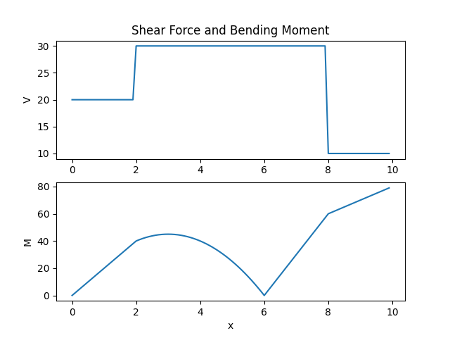

# Beam Analysis using Python

This project provides a **Python-based tool for beam analysis**, supporting **pin-roller and cantilever beams**. It computes **reaction forces, shear force, bending moment, torque, normal stress, and shear stress** using symbolic and numerical methods.

## 📌 Features
- **Static Analysis**:
  - Calculates **reaction forces and moments** at supports.
- **Mechanical Analysis**:
  - Computes **shear force (V), bending moment (M), torque (T)**.
  - Determines **maximum normal and shear stresses**.
- **Visualization**:
  - Plots **loading conditions, shear force, bending moment, torque, and stress distributions**.

---

## 🏗️ How It Works
The program models a **beam with various loading conditions** and analyzes its structural behavior. The beam geometry is characterized by:
- **Width (W) & Flange (F)**: Defines cross-sectional shape.
- **Material properties**: Used for stress analysis.
- **Support Conditions**:
  - **Cantilever Beam**: Fixed at one end.
  - **Pin-Roller Beam**: Supported at two points.

### **Implemented Methods**
- **`floading(x, y, x1, x2=None)`**: Adds **force loading** at position `x1` (point force) or between `x1` and `x2` (distributed load).
- **`mloading(x, z, x1, x2=None)`**: Adds **moment loading** in `x` or `z` direction.
- **`calculate()`**: Performs **static and mechanical analysis**.
- **`reactions()`**: Returns **reaction forces and moments**.
- **`bending()`**: Provides **shear force (V), bending moment (M) equations**.
- **`bending_plot()`**: Plots **V(x) and M(x)**.
- **`torque()`**: Returns **torque equation (Mx)**.
- **`torque_plot()`**: Plots **torque distribution**.
- **`tau_y_max()`**: Computes **maximum shear stress**.
- **`normal_stress_max()`**: Computes **maximum normal stress**.
- **`tau_xy_max()`**: Computes **maximum shear stress due to torsion**.

---

## 🚀 How to Use
### **1️⃣ Install Dependencies**
Ensure you have **Python 3.x** installed and install required libraries:
```bash
pip install numpy matplotlib sympy
```

### **2️⃣ Import & Define Beam**
```python
from Beam import Beam

beam = Beam(lenght=10, F=0.3, W=0.4, FT=0.02, WT=0.02, xpin=0, xroller=8)
```

### **3️⃣ Add Loadings**
```python
beam.floading(x="5", y="0", x1=4)  # Point force at x=4
beam.mloading(x="0", z="10*x", x1=2, x2=6)  # Moment loading
```

### **4️⃣ Perform Analysis**
```python
beam.calculate()
print(beam.reactions())  # Print reaction forces
```

### **5️⃣ Generate Plots**
```python
beam.bending_plot().show()  # Plot shear force & bending moment
beam.torque_plot().show()  # Plot torque distribution
```

---

## 📜 Example Outputs
1. **Reaction Forces**:
   ```python
   {'Nx_pin': -5, 'Ny_pin': 20, 'N_roller': -20, 'Mx': 0}
   ```
2. **Bending Moment Equation**:  
   <h3 style="text-align:center;">$M(x)\,=\,10 \left(\frac{x^{2}}{2} - 18\right) {\left\langle x - 6 \right\rangle}^{0} - 10 \left(\frac{x^{2}}{2} - 2\right) {\left\langle x - 2 \right\rangle}^{0} + 20 {\left\langle x \right\rangle}^{1} + 10 {\left\langle x - 2 \right\rangle}^{1} - 20 {\left\langle x - 8 \right\rangle}^{1}$</h3>  
3. **Bending Plot**:  
   

---

## 🏗️ Future Improvements
- Add **dynamic analysis** (time-dependent loads).
- Implement **material property selection** for stress calculations.
- Extend to **3D beam structures**.

---

## 📧 Contact
For any questions or contributions, feel free to reach out.

---

📌 **Developed for Structural Analysis & Mechanics Applications**